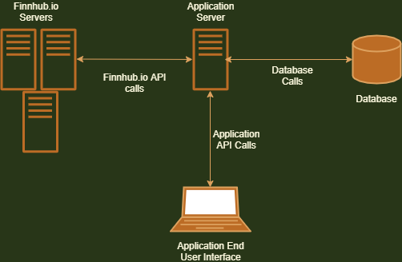

# stockMarketTool

## Use
This tool will help me target different stocks to invest in using various trading strategies

## Motivation
As a new investor/trader, there are limited tools that help me target specific stocks to invest in based on my buying power and other factors. I wanted to make an app that I can use to learn about the stock market, as well as, receive real time information and recommendations that I can evaluate and make investing decisions. This tool will allow me to receive investing recommendations from Finnhub.io based on factors important for investing. This application is targeted at new investors and those who simply don't have time in their schedules to research the market but still want to invest and trade consistently. The stock market can be a hard and daunting thought for most and I hope this application can mitigate some of those fears and encourage everyone to trade intelligently. 
To start this application will only recommend stocks to the user. It is then on the user to analyze the recommendations and actually buy/sell. As the application is developed, I hope to continue to give the user more intelligent recommendations and allow for further customization for the user. Also, in the future, I would like to provide users with performance of certain strategies.

## Basic Architecture

### Application Server
This server will be responsible for contacting Finnhub.io to receive stock data as requested by the user.
It will also run logic to recommend stocks to invest in for the user.
The server will contact the database to store user information (i.e. user Finnhub.io key, invested stocks, buying power, etc.)

**Implementation**

The Application will run on the Node.js runtime and will be implemented with Express, a Node backend framework
During development, the server will run on local host for simplicity

### Finnhub.io Servers
This application will contact [Finnhub.io](finnhub.io) to gain pricing information and expert analysis recommendations.
An API key is needed to make requests for Finnhub.io data

**Implementation**

The Node.js & Express server will communicate with Finnhub.io to make HTTP GET calls for financtial data

### Database
The database will be responsible for storing user specific data (i.e. Finnhub.io key, invested stocks, buying power, etc.)

**Implementation**

MongoDB will be used for the database for this application. This is because the data collected from the user will be unstructured as the app is developed and implementation is added.

### Application End User Interface
The end user will provide the application their finnhub.io api key, as well as, other information to the application server where the logic will be executed
The end user will be able to view recommended stocks based on different variables (i.e. buying power, preferred company sector, investing strategy, etc.)

**Implementation**

The frontend of the application will be implemented with Vue.js. Vue was chosen because the application will act reactively as the user interacts with it

### Server Request Handling
First the server will initialize and start listening on a localhost port
Once the server is up and running, the server should be able to begin handling client requests for financial data

**Implementation**

This is done by listening on the port with Express. Then when a HTTP GET request is received on the port, the server contacts the Finnhub.io Servers with an Axios GET request. This Axios GET request returns a Promise. Once that Promise is resolved (or rejected), the server will send the client, who sent the original GET request, the data returned by Finnhub.io (or an error message if the Promise was rejected) through an Express send.

